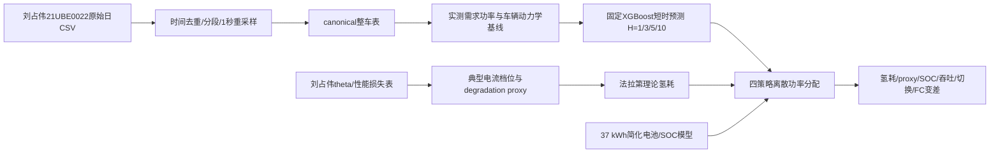

# 最小可运行框架与项目流程总览

## 1. 研究对象

项目研究对象是燃料电池—动力电池混合动力车辆的短时需求预测和退化代理感知功率分配。决策变量是燃料电池离散功率档位，电池功率由 `P_bat=P_dem-P_fc` 得到。当前目标是验证“需求数据→预测→氢耗/退化代理/电池成本→功率分配”的闭环能稳定运行，不追求最优参数。

degradation proxy 表示刘占伟老化参数和电压模型给出的当前性能损失代理，不是某次动作造成的真实材料退化增量，也不是经整车寿命试验标定的退化系数。

## 2. 总流程

## 3. 数据流

主数据来自刘占伟目录中的7个 `21UBE0022_粤B02625F-2025-05-*.csv`。原始106,162行，278个重复时间戳聚合后为105,884个唯一记录；按相邻记录间隔大于10 s划分46个运行片段，片段内重采样到1 s，得到211,630行。时间范围为2025-05-17 08:10:14至2025-05-27 09:55:30。绝不跨运行片段插值。

当前canonical实际保留：时间、片段ID、车速、SOC、目标功率、可加载功率、FC/DCDC/电池/电机V-I、耗氢原始字段、里程、平均/最低/最高节电压，以及由V×I派生的功率。processed进一步增加平滑车速、平滑加速度、车辆动力学力/功率、实测需求功率和动力学残差。

当前processed没有DCDC目标电流、明确FC状态、空气流量、温度、压力、空压机、水泵、氢泵、风扇、电加热器、完整单体电压阵列。使用这些字段前必须回到原始CSV重新映射，不能假定已经存在。

需求功率 `p_dem_measured_kw` 当前定义为原始电机电压×电流/1000并保留传感器符号。车速由km/h除以3.6变为m/s；加速度只在片段内差分。预测按70%训练、15%验证、15%测试顺序切分，边界保留H秒purge gap，不随机打乱。输入只使用当前与过去30 s信息。

## 4. 模型流

### 车辆动力学

输入车速、加速度、质量、风阻、滚阻和坡度，输出轮端动力学功率，再以训练前70%数据分别校准牵引和制动映射。它用于物理趋势对照，不是最终唯一预测器。测试总RMSE为17.85 kW；制动RMSE为24.35 kW，反映坡度、载荷、踏板和道路信息缺失。

### 需求预测

固定使用XGBoost。输入为过去30 s车速、加速度、需求功率及统计量、SOC、时刻、运行模式和因果停车状态。分别直接预测未来H秒轨迹。H=5是默认；H=10仅作长时域误差对照。Constant不是学习模型；Perfect读取真实未来，只是非因果参考。

### 氢耗

采用170节电堆的法拉第理论模型 `m_H2=N_cell*I*M_H2/(2F)`。canonical虽保留单次/累计耗氢字段，但其重置、分辨率和单位链尚未完成标定审计，所以当前不能声称氢耗已由实测数据校准。

### degradation proxy

典型电流档位和电压性能损失来自刘占伟 `theta=[i0,ih,R_ohm]`/Stage 6表，再归一化为决策成本。它按所选档位逐秒加入目标函数。`x_est`与21UBE0022是否同车同堆尚未证明，因此只作为跨数据链代理。

### 电池

采用37 kWh简化Rint/SOC模型，充放电效率均0.95，功率范围-75至120 kW，SOC范围0.30至0.90。容量、内阻和效率来自当前参考模型，未完成21UBE0022车辆级标定，属于待核参数。

## 5. 控制流

- Instant（瞬时策略）：只看当前需求，预测域1 s。
- Constant MPC（恒值预测MPC）：H=5，未来需求都等于当前值。
- Perfect MPC（完美预览MPC）：H=5，使用真实未来需求；不可部署，也不是全局DP下界。
- Predicted MPC（预测MPC）：H=5，使用固定XGBoost的因果未来预测。

四者使用同一固定权重、相邻档位约束、15 s最小驻留、电池功率/SOC约束和有限beam search。评价包括氢耗、proxy、末端SOC、电池吞吐、切换、FC总变差、裁剪与运行时间。

## 6. baseline与optimization边界

baseline只运行 `scripts/run_baseline.py`、编号01/03/04和 `scripts/baseline/05--06`。`scripts/07--12`属于已保留的optimization experiments（瓶颈诊断、字段消融、联合搜索、Pareto和优化汇总），主流程不会调用。
